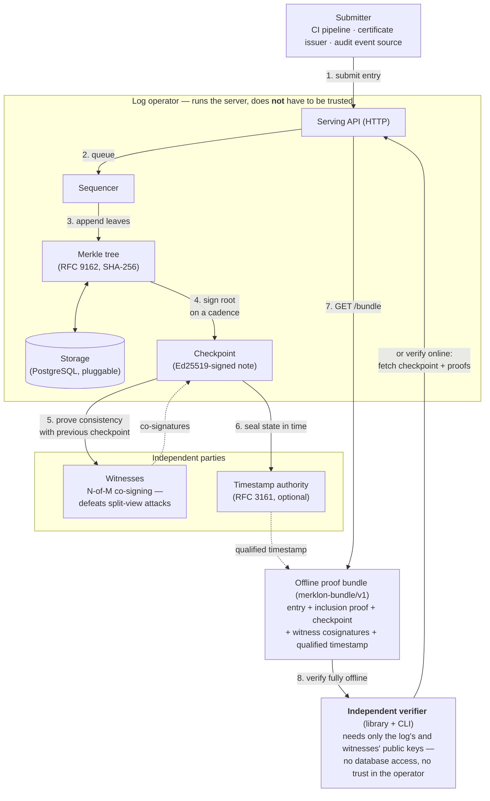

<!--
Copyright 2026 Trustbeat s.r.o.
SPDX-License-Identifier: Apache-2.0

Plain-language marketing / explainer overview. Audience: non-specialist evaluators,
decision-makers, and newcomers. For architecture see DESIGN.md; for wire formats see SPEC.md.
-->

# merklon — verify, don't trust

**merklon is a tamper-evident, append-only logbook that anyone can check — without trusting
whoever runs it.**

---

## What it is

Think of a notary's ledger where:

- You can only **add** entries to the end. You can never edit, reorder, or delete past entries.
- Every entry gets a cryptographic **receipt** proving it's really in the book.
- Anyone can independently verify the book has never been secretly rewritten — even if the
  operator is dishonest.

The magic is a **Merkle tree**: every entry is hashed, and those hashes are combined upward into a
single fingerprint (the "root") representing the *entire* log. Change any past entry and the
fingerprint changes — so tampering is mathematically detectable.

It produces two kinds of proof:

- **Inclusion proof** — "entry X is genuinely in the log" (a handful of hashes, not the whole log).
- **Consistency proof** — "the log today is the *same* log as yesterday, just with more entries
  appended — nothing was rewritten." This is the heart of it.

## The core idea: *don't trust — verify*

A normal database asks you to trust the company running it. merklon doesn't. It ships an
**independent verifier** — a small command-line tool that checks the proofs using only math and the
log's public key. It needs no access to the server's database and assumes the server might be lying.
If the proof checks out, the claim is true regardless of who's serving it.

That's the whole point: it replaces *"trust us"* with *"check it yourself."*

## How the whole thing works

Step by step:

1. A **submitter** (a build pipeline, an issuer, any event source) posts an entry to the log's
   HTTP API.
2. The **sequencer** queues it and, on a fixed cadence, appends pending entries to the
   **Merkle tree**; every entry gets a permanent index and the tree gets a new root fingerprint.
3. Entries and tree nodes are persisted through a pluggable **storage** interface
   (PostgreSQL today).
4. On each cadence tick the log publishes a **checkpoint** — a small signed note saying
   *"the log now has N entries and this exact fingerprint."*
5. Independent **witnesses** check that each new checkpoint is a pure extension of the previous
   one (nothing rewritten) and co-sign it. A client can demand N-of-M witness signatures, so the
   operator can't show different versions of the log to different people.
6. Optionally, an **RFC 3161 timestamp authority** seals the checkpoint in time — proof the
   state existed *at that moment*, strong enough for legal/compliance evidence.
7. Anyone can export a **proof bundle**: one self-contained file with the entry, its inclusion
   proof, the checkpoint, witness signatures, and the timestamp.
8. The **independent verifier** checks all of it — inclusion, consistency, signatures, witness
   policy, timestamp — using only math and public keys. Fully offline if given a bundle; no
   database, no trust in the server.

The one-line takeaway from the picture: everything inside the operator's box is *untrusted* —
every claim it makes is checked from outside, by the witnesses and by your own verifier.

## Who it's useful for

This is infrastructure, so the users are systems and the teams who run them:

| User | What they get |
|---|---|
| **Software supply chain / CI-CD teams** | A public record of "this exact build/artifact was produced," so users can detect a backdoored or swapped binary. |
| **Certificate authorities & PKI** | The original use case (Certificate Transparency / RFC 9162): every TLS certificate issued is logged publicly, so a maliciously-issued certificate for your bank can be spotted. |
| **Audit & compliance teams** | A log of security-relevant events (access grants, config changes, approvals) that *provably* can't be quietly edited after the fact — strong evidence for auditors and regulators. |
| **Legal / evidence / timestamping** | "This document or state provably existed at this time and hasn't changed since" — especially with qualified timestamps, which map to EU eIDAS legal-evidence needs. |
| **Anyone needing receipts** | Submitters get a proof their entry was recorded; third-party auditors and monitors can watch the log for foul play without any special access. |

## Who it's *not* for

It's deliberately **not** a general database, not a blockchain, and not a turnkey product. It
doesn't do user accounts, billing, or dashboards. It's the trustworthy *engine*; building a
finished application on top is a separate, downstream concern.

## In one sentence

> **merklon is an open-source "trust engine" — an append-only log whose honesty you can verify
> yourself instead of taking on faith — useful wherever it matters that a record of events is
> provably complete and unaltered: software releases, certificates, audit trails, and legal
> timestamping.**

---

*Open source, Apache-2.0, © Trustbeat s.r.o. Architecture: [`DESIGN.md`](DESIGN.md) · Wire
formats: [`SPEC.md`](SPEC.md)*
